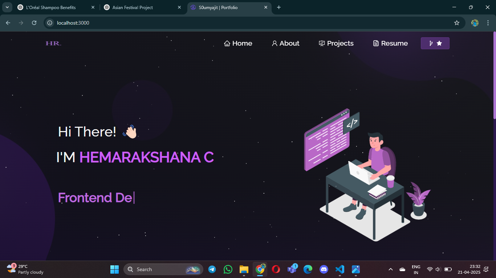

# 🌐 Portfolio Website



Welcome to my personal **portfolio website** repository! This project showcases my skills, projects, and background as a developer.

---

## 📌 About

This is a responsive and customizable personal portfolio website built using modern web technologies. It includes details about me, my technical skills, featured projects, and contact information.

---

## 🛠️ Built With

- HTML5  
- CSS3  
- JavaScript  
- React.js  
- Node.js  
- Express.js  

---

## 🚀 Features

- ✨ Clean multi-page layout  
- 🎨 Customizable design  
- 📱 Fully responsive for mobile, tablet, and desktop  
- 🧩 Easy to extend and maintain  

---

## 📁 Getting Started

To get a local copy up and running, follow these steps:

### 🔧 Prerequisites

Make sure you have **Node.js** and **Git** installed.

### 🔽 Installation

1. **Clone the repository**
   ```bash
   git clone https://github.com/hemarakshana/portfolio.git
   ```

2. **Navigate to the project directory**
   ```bash
   cd portfolio
   ```

3. **Install dependencies**
   ```bash
   npm install
   ```

4. **Run the development server**
   ```bash
   npm start
   ```

Open your browser and go to: `http://localhost:3000`

---

## ✏️ Customization

- Go to `/src/components/` to update your content (About, Skills, Projects, Contact).
- Modify styles in `/src/styles/` or relevant CSS files.

---

## 🙌 Contributing

Pull requests are welcome! For major changes, please open an issue first to discuss what you’d like to change.

---

## ⭐ Show Your Support

If you like this project, consider giving it a star on GitHub!

---

## 📬 Contact

Feel free to reach out if you have suggestions or feedback.

**GitHub:** [hemarakshana](https://github.com/hemarakshana)
